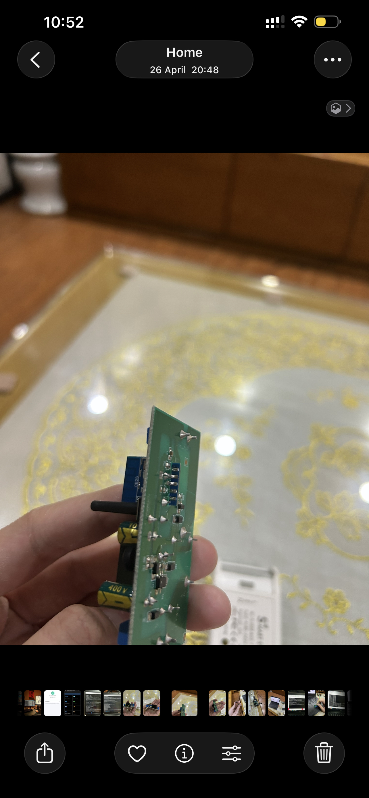
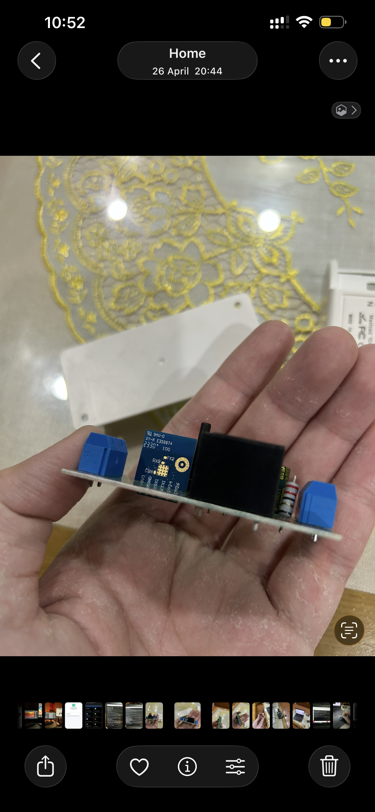
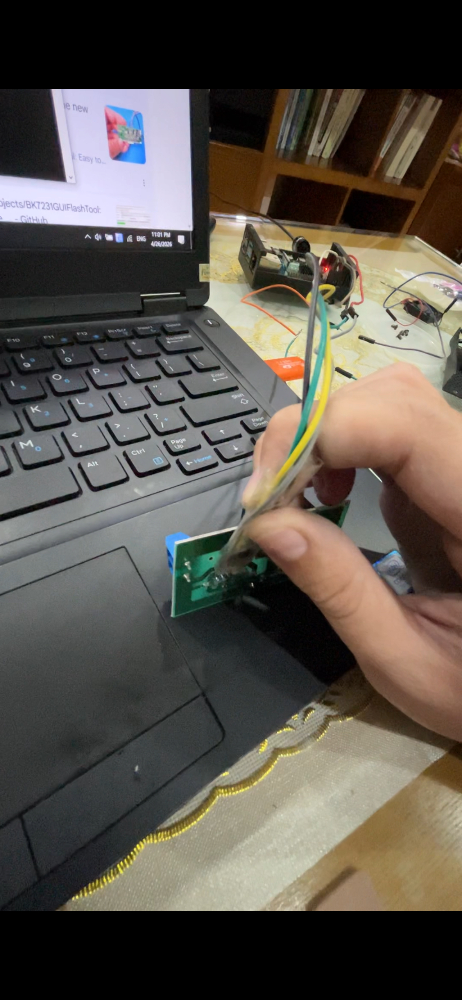

# Decoration Lights
A Tuya 10A Relay switch, used as a switch to control my decoration lights in my room. Original product link on [Shopee](https://vn.shp.ee/wojsUnWB).\
Device is named "Smart Sonoff" as seen on Tuya IoT Developer page.

## Hardware
Device is powered by a [Tuya CB2S module](https://developer.tuya.com/en/docs/iot/cb2s-module-datasheet?id=Kafgfsa2aaypq), which is in turn a BK7231N chip with small footprint.\
Original firmware dump via `ltchiptool` analyzing shows GPIO23 as an on/off switch for switch 1, though it does not do anything (?).
```
I: Loaded settings from C:\Users\QuanTrieuPCYT\AppData\Roaming\ltchiptool\gui.json
W: Block by ID 8 does not exist, returning empty
I: UPK: Found BK7231N config!
I: UPK: Switch/plug config
I: UPK:  - relay 1: pin P24
I: UPK:  - ON/OFF switch 1: pin P23
I: UPK:  - all-toggle button: pin P8
I: UPK: Status LED: pin P7, inverted True
```

| GPIO | Function                 |
|------|--------------------------|
| 7    | LED Indicator (inverted) |
| 24   | Relay                    |
| 8    | Button                   |

## Flashing
Device came with patched firmware which made [tuya-cloudcutter](https://github.com/tuya-cloudcutter/tuya-cloudcutter) unusable, as a result hardware flashing via serial is required. You can use an USB-to-Serial adapter, or a Raspberry Pi 4 like me.\
Flashing is comfortable on this board and can be done without a soldering iron. There isn't any testpoints, but the chip has the pads nicely exposed so we can use some dupont jumper wires and comfortably poke them in with a bit of light force. Here are the wirings required:

| Programmer | CB2S |
|------------|------|
| TX         | RX   |
| RX         | TX   |
| GND        | GND  |
| 3V3        | VCC  |

The Beken chip when waking up will see if there's activity present on the TX and RX pin, if yes it puts itself into download mode. If the chip isn't getting recognized by your programmer, try momentarily pulling `CEN` to `GND` or manually reseating the connection.





## Features
This switch is always behind my guitar, so physically interacting with it is not an usual thing for me. The switch functions exactly like the original firmware, but now with the lightweight and benefits of ESPHome not sending my traffics to some random cloud!\
The relay now also activates **when the button is first held in**, not after releasing the button like the original firmware so it will be faster too.

## Notes
Wi-Fi Power Saving Mode is disabled to improve connection stability.