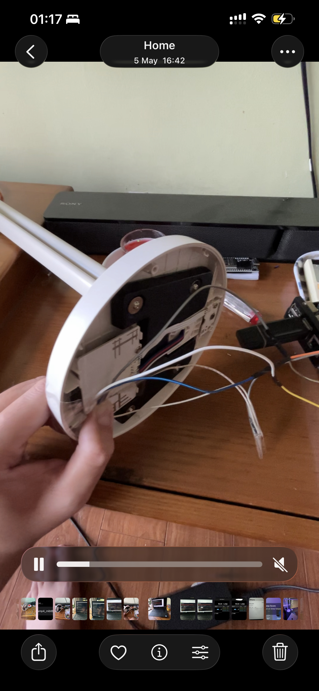

# Desk Lamp
A [Mi Desk Lamp 1S](https://www.mi.com/global/product/mi-led-desk-lamp-1s) flashed with ESPHome firmware.\
It has the codename `Mango1S` with the device identifier `yeelink.light.lamp4`. Original firmware seems to use the good ol' `miio` protocol, lamp can also be controlled with the new `miot` protocol. Original firmware boot log can be found [here](assets/original_boot.log) (bootlogs of a factory resetted device).

## Hardware
This lamp is powered by an ESP32, albeit a single core variant.

| GPIO | Function                          |
|------|-----------------------------------|
| 33   | Knob Button (pulldown, inverted)  |
| 16   | Reset Button (pulldown, inverted) |
| 27   | Rotary Encoder (pin A)            |
| 26   | Rotary Encoder (pin B)            |
| 12   | Power Supply                      |
| 2    | Cold White                        |
| 4    | Warm White                        |

## Flashing
No known exploit or method that allows OTA flashing for this device, as a result hardware flashing via serial is required. You can use an USB-to-Serial adapter, or a Raspberry Pi 4 like me.\
Flashing is comfortable on this board and can be done without a soldering iron. Pulling GPIO0 to GND is required for the ESP to enter download mode. Here are the wirings required:

| Programmer | ESP32 |
|------------|-------|
| TX         | RX    |
| RX         | TX    |
| GND        | GND   |
| 3V3        | VCC   |
| GND        | GPIO0 |

The pins are very nicely exposed. A hairdryer and a screwdriver should help you get into the devices, and flashing can even be made without a soldering iron! I used some tape and held it with 2 fingers for the pads to make contact.

## Features
I tried to mimic the original user experience as the original firmware as close as possible while adding my features:
- Press the knob to toggle the lamp.
- Hold and spin the knob while the lamp is on to adjust temperature.
- Minimum brightness is now much lower compared to the original firmware. The amber white now glows fantastically in the dark!
- Double clicking, Tripleclicking, Quadclicking and Holding the knob button control some home appliances via [homeSwiftPackets](https://github.com/QuanTrieuPCYT/homeSwiftPackets).
- LED Indicator is controllable as an entity in home automation systems.

## Notes
Wi-Fi Power Saving Mode is disabled to fix flickering + improve connection stability.