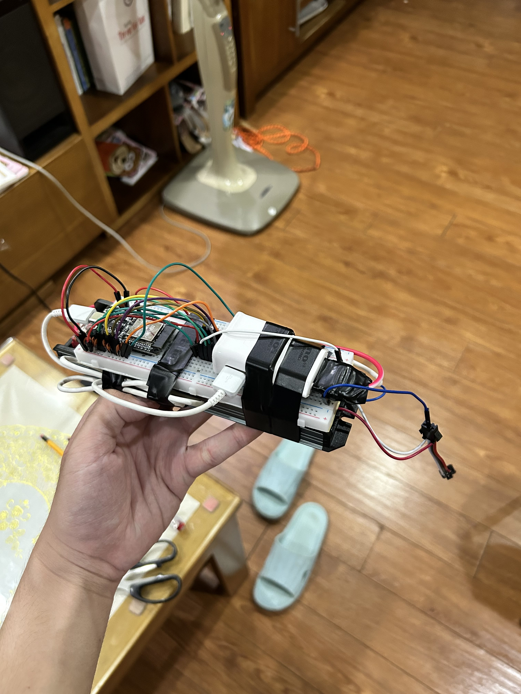

# LED Light
My custom-made, homemade LED controller. Designed to drive 24V WS2814 LED strips with power consumption upto 400W.\
Powered by an ESP32 on a breadboard with some dupont jumper wires, taped together with a 24V 400W PSU, and definitely looks like a bomb 😂!

## Hardware
Powered by an ESP32 development board that I got from Shopee for less than 3.5$. GPIO27 is used for LED data out and have its signals amplified via a logic level shifter (SN74AHCT125N) that bumps from 3.3V to 5V. GPIO2 is built into the ESP board as a controllable blue LED so I just used it for status LED. `BOOT` button (wired to GPIO0 and pull down to `GND` when pressed) is also repurposed for toggling the light as well, as long as I don't hold it on startup.

| GPIO | Function                    |
|------|-----------------------------|
| 0    | Button (pulldown, inverted) |
| 2    | LED Indicator               |
| 27   | WS2814 Data                 |

## Flashing
The ESP32 board included a CH340 chip, so flashing it of course is VERY EASY. Use a data-capable USB-C cable, hold down the `BOOT` button and plugging in the cable to put it into Download Mode. After that you can flash the ESP32 with any binaries.

## Purpose
To drive my 5m 60-pixel 420-LED WS2814 strip with ease (this thing consumes like 100W at max so my PSU will handle it just fine).

## Notes
Wi-Fi Power Saving Mode is disabled to fix flickering + improve connection stability.