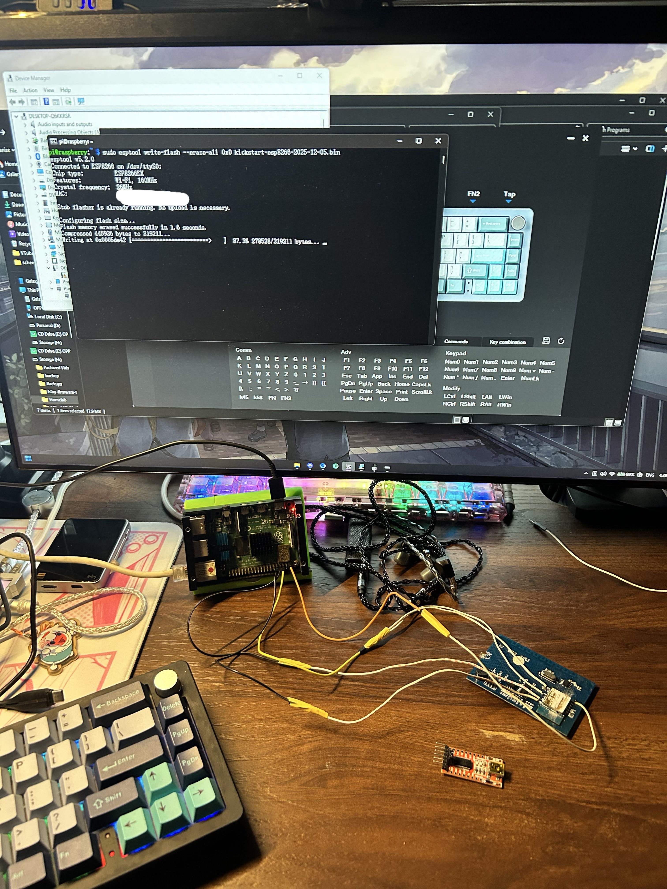

# Wall Switch
A generic Tuya 2CH Wall Switch. Not much is known about the device, I bought this little guy back in 2019 and used LocalTuya with it, and later I migrated to Tasmota firmware.\
There is this "newer" or "more premium" variant of the wall switch [here](https://dientuthongminh.vn/san-pham/cong-tac-wifi-tuya) which includes RF443 support. The link is also from the distributor who I originally bought the wall switch from years ago.

## Hardware
This device is powered by a [Tuya TYWE3S module](https://developer.tuya.com/en/docs/iot/wifie3smodule?id=K9605ua1cx9tv), which in turn is Tuya's clone of the famous ESP8266 chip.

| GPIO | Function                    |
|------|-----------------------------|
| 16   | LED Indicator (inverted)    |
| 13   | Relay 1                     |
| 4    | Relay 2                     |
| 12   | Button 1 (pullup, inverted) |
| 14   | Button 2 (pullup, inverted) |

The ring indicator of the buttons are hard-wired to the relay, they are controlled based on the state of the relays.

## Flashing
Device came with patched firmware, which makes [tuya-convert](https://github.com/ct-open-source/tuya-convert) unusable. As a result hardware flashing via serial is required. You can use an USB-to-Serial adapter, or a Raspberry Pi 4 like me.\
No exposed testpoints available, hence you need to solder some wires directly onto the chip. Pulling GPIO0 to GND is required for the ESP to enter download mode. Here are the wirings required:

| Programmer | ESP32 |
|------------|-------|
| TX         | RX    |
| RX         | TX    |
| GND        | GND   |
| 3V3        | VCC   |
| GND        | GPIO0 |

## Features
I tried to mimic the original user experience as the original firmware as close as possible while adding my features:
- Click Button 1 toggles Relay 1.
- Click Button 2 toggles Relay 2.
- Double clicking, Tripleclicking, Quadclicking and Holding the buttons control some home appliances via [homeSwiftPackets](https://github.com/QuanTrieuPCYT/homeSwiftPackets).
- LED Indicator is controllable as an entity in home automation systems.

## Notes
Wi-Fi Power Saving Mode is disabled to improve connection stability.